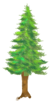

Hi everyone on our 3-rd lesson of the course “Canvas Basics Guide”.

At [the last lesson](/posts/canvas-basics-guide-shapes), we learned how to draw basic shapes. But for adding more opportunities for our animations or games we should learn how to add images. It’s the main topic of this lesson. Traditionally, we’ll use our template (```index.html``` and ```index.js```) from the previous lessons.

## How to get image

Firstly we should get an image that we'll draw on the ```canvas```. There are a few ways how to get an image. The easier way is getting an image from the same page from the ```DOM element```, for example::

```html:title=index.html

```

```js:title=index.js
const img = document.getElementById('img')
```

You can create your image directly using javascript:

```js:title=index.js
const img = new Image()
img.src = 'some.png'
```

Also, you can create an image via ```data:URL```, but as it isn't so popular way, we won't consider it in our tutorial.

Let's use the previous way and add some image into your working directory for getting it using ```javascript```.

I add an image of tree:



You can use this one or any that you want.

Also, we need to update our ```index.js```:

```js:title=index.js
const canvas = document.getElementById('canvas')
const ctx = canvas.getContext('2d')

const img = new Image()  // highlight-line
img.src = './tree.png'  // highlight-line
```

## How to draw an image on canvas

It's really easier than you can think. You have to use just the ```drawImage``` method. It has 3 required parameters: ```img``` (your source), ```x```, and ```y``` (position, where you put left top angle of your image). Let's use it to output our image:

```js:title=index.js
const canvas = document.getElementById('canvas')
const ctx = canvas.getContext('2d')

const img = new Image()
img.src = './tree.png'
ctx.drawImage(img, 0, 0) // highlight-line
```

Is canvas still empty? The point that your image didn't load at this moment. You have to handle ```onload``` event (not necessary if you use a loaded image from ```DOM```):

```js:title=index.js
const canvas = document.getElementById('canvas')
const ctx = canvas.getContext('2d')

const img = new Image()
img.onload = () => {         // highlight-line
  ctx.drawImage(img, 0, 0)   // highlight-line
}                            // highlight-line

img.src = './tree.png'       // highlight-line
```

Now, you can see our tree on the canvas:


## How to change image size

Also, you can pass 2 additional parameters into the ```drawImage``` method: ```width```, ```height```. Let's try to decrease our tree:

```js:title=index.js
const canvas = document.getElementById('canvas')
const ctx = canvas.getContext('2d')

const img = new Image()
img.onload = () => {
  ctx.drawImage(img, 0, 0, 50, 100)   // highlight-line
}

img.src = './tree.png'
```

Nice, we get a little tree:


### Example: let's create a forest

Now, I'm calling you to try to stop global warming by creating a big forest. Just some logic:

```js:title=index.js
const canvas = document.getElementById('canvas')
const ctx = canvas.getContext('2d')

const img = new Image()

const amountOfTrees = 1000
const [canvasWidth, canvasHeight] = [500, 500]
const [imgWidth, imgHeight] = [100, 200]
// size coefficients
const [minC, maxC] = [0.1, 0.2]

img.onload = () => {
  for (let i = 0; i < amountOfTrees; i++) {
    const x = (Math.random() * (canvasWidth - imgWidth * maxC))
    const y = (Math.random() * (canvasHeight - imgHeight * maxC))
    // to make top trees smaller than trees at the bottom, for visual effect
    const currentK = (y / canvasHeight) * (maxC - minC) + minC
    const treeWidth = imgWidth * currentK
    const treeHeight = imgHeight * currentK
    ctx.drawImage(img, x, y, treeWidth, treeHeight)
  }
}

img.src = './tree.png'
```

Also, we can set some ```background``` for our canvas and change ```border``` color:

```html:title=index.html
<style media="screen">
  canvas {
    display: block;
    margin: 0 auto;
    border: 1px green dashed;        // highlight-line
    background: floralwhite;         // highlight-line
  }
</style>
<canvas id="canvas" height="500" width="500"></canvas>
<script src="./index.js"></script>
```

The result:


## Conclusions

So, in that tutorial we learned how to draw images on ```canvas``` using the ```drawImage``` method, consider additional parameters for changing ```width``` or ```height``` of an image, and grows our own forest. In [the next part](/posts/canvas-basics-guide-animations), we’ll consider how to make simple animations.
