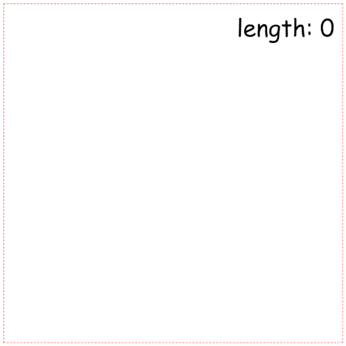
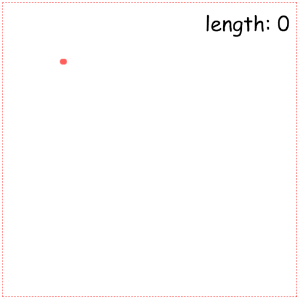

Hi everyone and welcome to the first tutorial on my blog! I’m amadev, and this info should be enough for you at this time. You might saw me at YouTube, so don’t wonder, yeap, it’s me. Let’s better write some code.😀

## Intro & preconditions

As you can notice we're going to create a "Snake" game. We'll use no frameworks and game engines for this. Just using plain ```javascript``` we'll create game step by step. The result shoud be like [this](/examples/snake-game-in-js) (DEMO).

## Place where everything begins

Let’s create the first file for our tiny project - ```index.html```. After that, we create a ```javascript``` file and connect it with ```index.html```

```html:title=index.html
<body>
  <script src="src/index.js"></script>
</body>
```

For rendering our game on the screen we’ll use ```canvas```. Also, let’s add an element for a score (snake length) and some styles:

```html:title=index.html
<body>
  <script src="src/index.js"></script>
  <style media="screen">
    #map {
      display: block;
      margin: 0 auto;
      border: 1px dashed red;
    }

    .wrapper {
      position: relative;
      width: 500px;
      height: 500px;
      margin: 0 auto;
    }

    #score {
      position: absolute;
      right: 0;
      top: 0;
      margin: 10px;
      font: 35px Comic Sans MS;
    }
  </style>
  <div class="wrapper">
    <p id="score">length: 0</p>
    <canvas id="map" width="500" height="500"></canvas>
  </div>
</body>
```

All that we have now it's:


## Time for javascript

Now, it’s time for our ```index.js```  from the previous step. We should catch the moment of rendering ```DOM``` elements. Do you know how to do that? One of the ways - ```window.onload``` method. Let’s use it for getting access to the ```DOM``` elements and starting our game loop.

```js:title=src/index.js
window.onload = () => {
  const canvas = document.getElementById('map')
  const ctx = canvas.getContext('2d')
  
  startGame()
}
```

After that, we can go to the implementation of the ```startGame``` function. We need some abstraction to collect all info about the game state. As it’s ```javascript``` - what can be better than an object?).

```js:title=src/index.js
const game = {}

startGame(game)
```

But what info should we keep there? We have at least 2 types of game objects: snake and foods. So we have to implement them and place into object ```game```.

Let’s start from ```class``` Snake Snake and define methods for it. At the start, it'll look like this:

```js:title=src/index.js
class Snake {
  constructor() {}
  // drawing snake on the canvas
  draw() {}
  // move snake
  running() {}

  // control snake using keyboard
  directionControl() {}

  // controll snakes grows
  snakeLengthControl() {}

  // check intersections with map boards
  validationCoordinates() {}

  // check inner collision of snake head with body
  findSnakeСollision() {}
}
```

Now we can describe them more details.
At first, we should decide what data we need to our snake, we’ll pass that data into a ```constructor```. For determination snake's head position we can use just ```x```, ```y```, and ```coordinates``` array for storing the previous position. Also, we need to know the snake ```lenght```, direction (```angle```), ```color```, canvas context that connected to snake (```ctx```).

After that we get constructor:

```js:title=src/index.js
constructor(x, y, angle, length, ctx) {
  this.x = x
  this.y = y
  this.angle = angle
  this.length = length
  this.ctx = ctx
  this.coordinates = []
}
```

But also we have some common characteristics, that we can separate from inner properties as ```static``` properties:

```js:title=src/index.js
Snake.COLOR = '#ff5050'
Snake.INITIAL_LENGTH = 150
Snake.HEAD_RADIUS = 5
Snake.SPEED = 2 // points per iteration
Snake.ROTATION_SPEED = 5 // degrees per iteration
```

Well, now let’s consider drawing method. We can implement that using ```canvas``` drawing methods. We should just draw circles of some radius and some color which we keep in our object.

So, it’ll look like that:

```js:title=src/index.js
draw() {
  this.ctx.beginPath()
  this.ctx.fillStyle = Snake.COLOR
  this.ctx.arc(this.x, this.y, Snake.HEAD_RADIUS, 0, 2 * Math.PI)
  this.ctx.fill()
  this.ctx.closePath()
}
```

But all that we have for now - it's an object which can paint static point on the canvas. As you can guess we’re going to implement the ```running``` method. The logic of running is simple. On each iteration, we should change the snake's head position using speed:

```js:title=src/index.js
running() {
  this.x += Snake.SPEED
  this.y += Snake.SPEED
}
```

Ok, to test our ```running``` we should return to ```startGame``` function and implement the game loop. We stopped on the ```game``` object, that collects all data about our game objects and parameters. Now we can pass first of them into the ```game``` - the instance of ```Snake``` class:

```js:title=src/index.js
window.onload = () => {
  const canvas = document.getElementById('map')
  const ctx = canvas.getContext('2d')
  
 const snake = new Snake(100, 100, 0, Snake.INITIAL_LENGTH, ctx)  // highlight-line
  const game = {             // highlight-line
    snake,                   // highlight-line
  }                          // highlight-line
  
  startGame(game)            // highlight-line
}
```

So, now we have access to snake inside ```startGame```. To implement game loop we have to call ```running``` with some frequency. There are a few ways to do that, but we’ll choose the easier - ```setInterval```. After that our function will be like that:

```js:title=src/index.js
const startGame = (game) => {
  const { snake } = game
  
  game.snakeInterval = setInterval(snake.running, 30)
}
```

But, if you launch this code, you’ll get the error (```Uncaught TypeError: Cannot read property 'angle' of undefined
at running```) inside ```running``` method, because setInterval loses context and ```running``` method doesn’t know anything about the snake, to solve that we should ```bind``` context to the method:


```js:title=src/index.js
const startGame = (game) => {
  const { snake } = game
  
  game.snakeInterval = setInterval(snake.running.bind(snake), 30) // highlight-line
}
```

Is your ```canvas``` still empty? We’re changing position on each iteration of ```setInterval```, but we don't call ```draw``` method to repaint our canvas, so some changes:

```js:title=src/index.js
running() {
  this.x += Snake.SPEED
  this.y += Snake.SPEED

  this.draw() // highlight-line
}
```

And now our canvas comes alive:



Ok, move forward and consider our control function. Our snake will turn due to keys' s events. Press on left arrow will turn snake to left and on right to turn it right. So we need to connect ```directionControl```  method with an event listener. There a no better place for that then ```startGame``` function. We can use ```eventListener``` on whole ```document``` object:

```js:title=src/index.js
const startGame = (game) => {
  const { snake } = game
  
  game.snakeInterval = setInterval(snake.running, 30)
 
  addEventListener('keydown', snake.directionControl) // highlight-line
}
```

Perfection, now ```directionControl``` will be called each time when you press on some key. And our method will get all the information about that event via the parameter. So, it’s time to handle that. We have a simple condition, if ```keyCode``` of the pressed key is ```37``` we’ll call a ```turnLeft``` method, that decrease snake ```angle```, and opposite way if keyCode is ```39```:


```js:title=src/index.js
directionControl(e) {
  switch(e.keyCode) {
    case 37: {
      this.turnLeft()
      break
    }
    case 39: {
      this.turnRight()
      break
    }
  }
}

turnLeft() {
  this.angle -= Snake.ROTATION_SPEED
}

turnRight() {
  this.angle += Snake.ROTATION_SPEED
}
```

However, we don’t use ```angle``` value. Where should we place it? Yep, into ```running```. At this moment our ```running``` method just increases the value of ```x``` and ```y```. Instead of that for getting coordinates (```x```, ```y```) changes, we must count projection of speed on the angle. For ```x``` it's ```speed * Math.cos(angle)``` and for y, as you can guess, ```speed * Math.sin(speed)```.

As you can notice we keep snake's direction in degrees, but for counting direction, we must convert them into radians:

```js:title=src/index.js
const degToRad = (angle) => ((angle * Math.PI) / 180)
```

After that, we'll get:

```js:title=src/index.js
running() {
  const radian = degToRad(this.angle)        // highlight-line
  this.x += Snake.SPEED * Math.cos(radian)   // highlight-line
  this.y += Snake.SPEED * Math.sin(radian)   // highlight-line

  this.draw()
}
```

After fixing, we'll get:

Let’s check our control. Did you also get an error? Actually, it’s the same problem with losing context for ```directionControl``` as we had for running inside ```setInterval```. Let’s bind our snake to ```directionControl```.

After fixing, we’ll get:

```js:title=src/index.js
const startGame = (game) => {
  const { snake } = game
  
  game.snakeInterval = setInterval(snake.running.bind(snake), 30)
 
  addEventListener('keydown', snake.directionControl.bind(snake)) // highlight-line
}
```

Let's test snake's controlling:



It's the first part of two articles about creating "Snake" game in JavaScript. In the next, we'll add foods, collisions, control of snake length. For now, you can leave your feedback below and share your ideas. Will be soon ...
